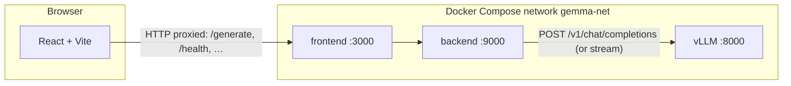

# Gemma 4 31B — vLLM inference stack with FastAPI gateway and React chat UI

This project runs **Google Gemma 4** (31B instruct, **RedHatAI/gemma-4-31B-it-NVFP4** on Hugging Face) behind **vLLM**, adds a **FastAPI** gateway for authentication, multimodal file handling, and usage tracking, and ships a **React + Vite** browser UI. After setup you get OpenAI-style **`/v1/chat/completions`** from vLLM and a simpler **`/generate`** / **`/generate/stream`** API from the gateway for the same model.

Reading this document should give you a clear **end-to-end** picture: what runs where, how traffic flows, how the images are built, and how configuration ties it together.

---

## Table of contents

1. [What you get at a glance](#what-you-get-at-a-glance)
2. [End-to-end: how the application works](#end-to-end-how-the-application-works)
3. [How we built this](#how-we-built-this)
4. [Where and how this is hosted](#where-and-how-this-is-hosted)
5. [Docker images and their configuration](#docker-images-and-their-configuration)
6. [Configuration (`.env`)](#configuration-env)
7. [Run the full stack (Docker Compose)](#run-the-full-stack-docker-compose)
8. [Run locally for development](#run-locally-for-development)
9. [Ports and networking](#ports-and-networking)
10. [HTTP API overview](#http-api-overview)
11. [Persistence, admin, and security notes](#persistence-admin-and-security-notes)
12. [Troubleshooting](#troubleshooting)
13. [Repository layout](#repository-layout)
14. [License and model terms](#license-and-model-terms)

---

## What you get at a glance

| Layer | Role |
|--------|------|
| **vLLM** | Serves the NVFP4 Gemma 4 checkpoint with an **OpenAI-compatible** HTTP API (`/v1/chat/completions`, `/health`, …). |
| **FastAPI gateway** (`app/main.py`) | Validates **`X-API-Key`**, normalizes multimodal payloads, calls vLLM via **`LLMClient`**, streams SSE for chat, optional user stats. |
| **React UI** (`frontend/`) | Chat with Markdown, attachments; dev server proxies API routes to the gateway. |

---

## End-to-end: how the application works

### High-level architecture



- **Browser → frontend container:** The Vite dev server listens on **3000** and **proxies** paths like `/generate`, `/generate/stream`, `/health`, `/info`, `/api/*` to the gateway URL set by **`VITE_API_PROXY`** (in Compose: `http://backend:9000`).
- **Gateway → vLLM:** The backend resolves **`LLM_BASE_URL`** to **`http://vllm:8000`** inside Compose. **`LLMClient`** (`app/llm_client.py`) POSTs to **`{LLM_BASE_URL}/v1/chat/completions`** (unless completion-only mode is enabled). Responses are parsed into plain text (or streamed as SSE chunks to the client).

### Request path (one chat turn)

1. The user types in the UI and may attach images or files.
2. The frontend sends **`POST /generate`** or **`POST /generate/stream`** to the gateway with header **`X-Api-Key`** (and optionally **`X-User-Name`** for stats).
3. **`verify_api_key`** in `app/main.py` compares the header to **`API_KEY`** from settings.
4. **`GenerateRequest`** (`app/schemas.py`) carries **`messages`** (preferred) or legacy **`prompt`**.
5. **`normalize_messages_for_llm`** in `app/attachments.py` expands uploads (e.g. PDF, Office, images) into **OpenAI-style** message parts (`text`, `image_url`, `file` metadata) suitable for vLLM.
6. **`LLMClient.generate`** or **`generate_stream`** builds the JSON body with **`model`** = **`MODEL_NAME`** (must match vLLM’s **`--served-model-name`**), **`temperature`**, optional **`max_tokens`**, and calls vLLM over HTTP (**`httpx`**).
7. The assistant text is returned as JSON (`response`) or as **SSE** lines (`data: {"text":"..."}` then `data: [DONE]`).

### Optional: static UI from the gateway

If you run **`npm run build`** in `frontend/`, **`frontend/dist/`** exists. **`app/main.py`** mounts it at **`/`** so a **single** Uvicorn process can serve both the static UI and the API. In day-to-day development, most people run **Vite on 3000** and **Uvicorn on 9000** separately.

---

## How we built this

### Technology choices

| Area | Choice |
|------|--------|
| **Inference** | **vLLM** (`vllm/vllm-openai` base), OpenAI-compatible server |
| **Model** | **RedHatAI/gemma-4-31B-it-NVFP4** with **`--served-model-name gemma4-31b`** |
| **Custom model support** | **Transformers** installed from **GitHub main** in our Dockerfile so **`gemma4`** architecture is registered even if the base image lags |
| **Gateway** | **Python 3.12**, **FastAPI**, **Uvicorn**, **httpx**, **pydantic-settings** |
| **Multimodal / files** | **Pillow**, **pillow-heif**, **pypdf**, **python-docx**, **openpyxl**, **xlrd** (see `requirements.txt`) |
| **Frontend** | **React**, **Vite**, **Node 20** |
| **Packaging** | **Docker** + **Docker Compose**; three services, three Dockerfiles |

### Repository role (short)

| Path | Purpose |
|------|---------|
| `app/main.py` | FastAPI app: routes, CORS, API key auth, generate/stream, admin HTML |
| `app/config.py` | **`Settings`** from **`.env`** (repository root) |
| `app/llm_client.py` | HTTP client to vLLM: chat, stream, optional completions / Ollama paths |
| `app/attachments.py` | Normalize messages and file/image parts for the model |
| `app/user_tracker.py` | JSON-backed usage stats under **`data/users.json`** |
| `docker/vllm-gemma4.Dockerfile` | **Custom vLLM image** (nightly + Transformers from git) |
| `docker/backend.Dockerfile` | **Gateway image** (Python slim + deps) |
| `docker/frontend.Dockerfile` | **UI dev server image** (Node Alpine + Vite) |
| `docker-compose.yml` | Wires **vllm**, **backend**, **frontend** on **`gemma-net`** |

The top-level **`main.py`** is a minimal placeholder; the ASGI entrypoint is **`app.main:app`**.

---

## Where and how this is hosted

There is **no cloud-specific** deployment baked into this repo. The intended deployment model is **self-hosted**:

- **A machine with a suitable NVIDIA GPU** runs **Docker Engine** and the **NVIDIA Container Toolkit** so containers can use the GPU.
- **Docker Compose** (see **`docker-compose.yml`**) starts three containers on a **bridge network** (`gemma-net`). Published ports on the host are **8000** (vLLM), **9000** (gateway), **3000** (Vite UI).

**Typical environments:**

- **Linux server or workstation** with NVIDIA drivers + Docker.
- **Windows + WSL2 + Docker Desktop**: vLLM is Linux-oriented; teams often run Docker from WSL and open the UI at **`http://localhost:3000`** (or the host LAN IP). The gateway’s admin UI restricts **`/admin`** and **`/api/admin/*`** to **localhost** (and a configurable WSL bridge IP in code); see [Persistence, admin, and security notes](#persistence-admin-and-security-notes).

**Where processes run:** Inside Docker **containers** on your host. The **backend** container overrides **`LLM_BASE_URL=http://vllm:8000`** so the gateway talks to vLLM by **Docker DNS service name**, not `localhost`.

If you **push** the built images to a private registry, document your registry path and tags there; Compose in this repo **builds locally** unless you change **`image:`** lines to pull prebuilt images.

---

## Docker images and their configuration

Compose defines **three** build contexts. After **`docker compose up --build`**, **`docker images`** (or **`docker compose images`**) lists the built images (names depend on your project directory name, e.g. `<project>_vllm`).

### 1. Custom vLLM image (`docker/vllm-gemma4.Dockerfile`)

**Purpose:** Extend **`vllm/vllm-openai:nightly`** and install **Transformers from Git** so Gemma 4’s **`gemma4`** config is supported.

**Manual build / tag (from Dockerfile comments):**

```bash
docker build -f docker/vllm-gemma4.Dockerfile -t vllm-gemma4:local .
```

**Runtime command** (from **`docker-compose.yml`**, passed as the container command to the OpenAI entrypoint):

| Setting | Value |
|---------|--------|
| Model weights | `RedHatAI/gemma-4-31B-it-NVFP4` |
| Served name | `gemma4-31b` (clients send this as **`model`**) |
| Max context | `--max-model-len 32768` |
| GPU memory | `--gpu-memory-utilization 0.9` |
| Concurrent sequences | `--max-num-seqs 16` |
| Other | `--trust-remote-code` |

**Container configuration:**

- **Port:** `8000:8000`
- **GPU:** `deploy.resources.reservations.devices` — NVIDIA, all GPUs
- **IPC:** `host` (common for vLLM shared memory)
- **Volume:** `~/.cache/huggingface` → `/root/.cache/huggingface` (model cache on the host)
- **Env:** `HUGGING_FACE_HUB_TOKEN=${HF_TOKEN}` (for gated downloads; set **`HF_TOKEN`** in `.env` or shell)
- **Healthcheck:** HTTP GET to `http://localhost:8000/health` inside the container

### 2. Backend image (`docker/backend.Dockerfile`)

**Base:** `python:3.12-slim`

**Build steps:** System packages for Pillow/HEIF → **`pip install -r requirements.txt`** → copy repo.

**Runtime:**

- **EXPOSE** `9000`
- **CMD:** `uvicorn app.main:app --host 0.0.0.0 --port 9000 --reload --reload-dir app`
- **Compose:** mounts **`./app`** → `/app/app` and **`./data`** → `/app/data`; loads **`.env`** via **`env_file`**; sets **`LLM_BASE_URL=http://vllm:8000`** (overrides host-only `localhost` in `.env` for container-to-container calls)

### 3. Frontend image (`docker/frontend.Dockerfile`)

**Base:** `node:20-alpine`

**Build:** `npm ci`, copy frontend sources.

**Runtime:**

- **EXPOSE** `3000`
- **CMD:** `npx vite --host 0.0.0.0 --port 3000`
- **Compose:** mounts **`./frontend/src`** and **`./frontend/index.html`** for live edits; **`VITE_API_PROXY=http://backend:9000`** so the Vite proxy targets the gateway by service name

---

## Configuration (`.env`)

Create a **`.env`** file in the **repository root** (same directory as **`docker-compose.yml`**). It is **gitignored**. **`app/config.py`** loads it for the gateway.

### Required (gateway)

| Variable | Meaning |
|----------|---------|
| **`MODEL_NAME`** | Must match vLLM **`--served-model-name`** (e.g. `gemma4-31b`). |
| **`LLM_BASE_URL`** | Base URL **without** path (e.g. `http://localhost:8000` when vLLM is on the host). Alias: **`VLLM_URL`**. In Compose, **`LLM_BASE_URL=http://vllm:8000`** is set for the **backend** service. |
| **`TEMPERATURE`** | Sampling temperature sent to vLLM. |
| **`MAX_TOKENS`** | Max **new** tokens; use **`0`** to omit and let vLLM/model defaults apply. |
| **`REQUEST_TIMEOUT`** | Per-request HTTP timeout (seconds) for vLLM calls. |
| **`API_KEY`** | Shared secret; clients send **`X-API-Key`**. |
| **`HOST`** | Uvicorn bind address (e.g. `0.0.0.0`). |
| **`PORT`** | Uvicorn port (e.g. `9000`). |

### Optional

| Variable | Default | Meaning |
|----------|---------|---------|
| **`VLLM_USE_COMPLETIONS`** | `false` | Use **`/v1/completions`** instead of chat. |
| **`OLLAMA_NATIVE_VISION`** | `false` | If `true`, image paths use Ollama-style APIs; leave **`false`** for vLLM. |

### Hugging Face token (Compose + vLLM)

Set **`HF_TOKEN`** in `.env` (or your shell). Compose passes it as **`HUGGING_FACE_HUB_TOKEN`** to the **vllm** service for downloading weights.

### Example template

```env
MODEL_NAME=gemma4-31b
LLM_BASE_URL=http://localhost:8000

VLLM_USE_COMPLETIONS=false
OLLAMA_NATIVE_VISION=false

MAX_TOKENS=10000
TEMPERATURE=0.3
REQUEST_TIMEOUT=600

API_KEY=your-long-random-secretxxxxxx
HOST=0.0.0.0
PORT=9000

HF_TOKEN=hf_your_huggingface_token_here
```

---

## Run the full stack (Docker Compose)

**Prerequisites:** Docker, NVIDIA Container Toolkit, GPU drivers, and a **Hugging Face token** with access to the model.

1. Copy and edit **`.env`** as above.
2. From the repo root:

```bash
docker compose up --build
```

3. Wait for the **vllm** healthcheck (first run may download **large** weights into the Hugging Face cache volume).
4. Open the chat UI at **`http://localhost:3000`** (or your host IP on port **3000**).

**Services:**

- **vLLM:** `8000`
- **Gateway:** `9000`
- **Frontend (Vite):** `3000`

---

## Run locally for development

Use this when vLLM runs in Docker (or elsewhere) and you want hot reload for Python/React.

1. **Start vLLM only:** `docker compose up vllm` — or point **`LLM_BASE_URL`** at any reachable vLLM instance.
2. **Backend:** install deps (`uv sync` / `pip install -r requirements.txt`), then:

   ```bash
   uvicorn app.main:app --reload --host 0.0.0.0 --port 9000
   ```

   Set **`LLM_BASE_URL`** to **`http://127.0.0.1:8000`** if vLLM exposes port 8000 on the host.

3. **Frontend:**

   ```bash
   cd frontend
   npm ci
   npm run dev
   ```

   Optional: `export VITE_API_PROXY=http://127.0.0.1:9000` if the gateway is not on the default in **`vite.config.js`**.

---

## Ports and networking

| Port | Service | Purpose |
|------|---------|---------|
| **8000** | vLLM | Model server: **`/health`**, **`POST /v1/chat/completions`**, etc. |
| **9000** | FastAPI | Gateway + optional static **`frontend/dist`** at `/` |
| **3000** | Vite (dev) | React UI; proxies API routes to the gateway |

---

## HTTP API overview

**Base URL (gateway):** `http://127.0.0.1:9000` (or your host).

**Public (no API key):**

- **`GET /health`** — liveness (`{"status":"ok"}`); does not probe vLLM.
- **`GET /info`** — `model_name`, `completions_mode`.

**With API key (`X-Api-Key`):**

- **`POST /verify-api-key`** — `{"valid": true}` if the key matches.
- **`POST /api/login`** — JSON `name` + `api_key`; records login for tracking.
- **`POST /generate`** — JSON body **`GenerateRequest`**; returns `{"response": "..."}`.
- **`POST /generate/stream`** — same body; **SSE** stream of `text` chunks, then `[DONE]`.

**Errors:** **401** if the key is wrong; **502** if vLLM returns an error or is unreachable.

**Direct vLLM:** You can also call **`POST {LLM_BASE_URL}/v1/chat/completions`** with OpenAI-style JSON and **`model: gemma4-31b`**, bypassing the gateway (no **`API_KEY`** unless you add something in front).

CORS on the gateway allows **all origins** (fine for dev; tighten for production).

---

## Persistence, admin, and security notes

- **`data/users.json`** — created at runtime for login/message counters when using **`/api/login`** and **`X-User-Name`**. In Compose, **`./data`** is mounted at **`/app/data`**. Add **`data/`** to backups if you care about stats.
- **Admin (restricted by IP):** **`GET /api/admin/users`**, **`GET /api/admin/stats`**, **`GET /admin`**. **`app/main.py`** allows only IPs in **`_ADMIN_ALLOWED_IPS`** (localhost and a sample WSL bridge IP). Adjust that set if your browser reaches the server from a different interface.

---

## Troubleshooting

| Symptom | What to check |
|---------|----------------|
| **401** | **`X-Api-Key`** matches **`API_KEY`**. |
| **502** | **`LLM_BASE_URL`**, vLLM up, **`MODEL_NAME`** vs **`--served-model-name`**, GPU OOM, **`REQUEST_TIMEOUT`**. |
| UI cannot reach API | **`VITE_API_PROXY`** / proxy target; from Docker UI, use service hostname **`backend`**. |
| Weight download errors | **`HF_TOKEN`** and model access on Hugging Face. |
| OOM on GPU | Lower **`--max-model-len`**, **`--max-num-seqs`**, or **`--gpu-memory-utilization`** in Compose. |

For deeper design notes, see **`docs/ARCHITECTURE_AND_INFERENCE_OPTIMIZATION.md`**.

---

## Repository layout

| Path | Role |
|------|------|
| `app/` | Gateway, LLM client, attachments, schemas, user tracker |
| `frontend/` | React + Vite UI |
| `docker/` | Dockerfiles for vLLM, backend, frontend |
| `docker-compose.yml` | Full stack: GPU, gateway, UI |
| `scripts/` | Helper scripts (e.g. direct vLLM demos) |
| `data/` | Runtime JSON (gitignored; created when used) |

---

## License and model terms

Use of **Gemma** and third-party checkpoints is subject to their **license and acceptable use** policies on Hugging Face. This repository does not grant rights to the model weights.
