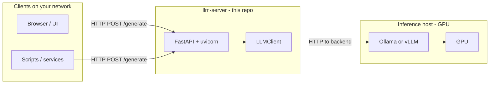

# LLM Server: Architecture & Inference Optimization Guide

This document explains how the **llm-server** gateway works end-to-end and how to tune the full stack for **low latency**, **stable quality**, and **predictable behavior** when teammates or services on your network call the exposed model.

---

## 1. What this project is (and is not)

| Role | Description |
|------|-------------|
| **This repository** | A **FastAPI gateway**: validates API keys, accepts HTTP requests, forwards them to a **separate** inference engine, returns plain JSON. It does **not** load model weights or run GPU kernels. |
| **Inference engine** | Typically **Ollama** (default port `11434`) or **vLLM** (often port `8000`). You run and tune that process on a GPU host independently of this app. |

Treating the gateway and the inference server as two layers is essential for optimization: most throughput and latency gains come from the **GPU server**, not from Python here.

---

## 2. High-level architecture

- **Clients** call the gateway at `HOST:PORT` (e.g. `0.0.0.0:9000` so the service listens on all interfaces and is reachable by LAN IP).
- The gateway **proxies** to `LLM_BASE_URL` (Ollama, vLLM, or any compatible OpenAI-style server—see below).

---

## 3. Request flow (step by step)

1. **Startup** (`app/main.py`): `Settings` loads from `.env`. A single `LLMClient` instance is created with those settings.
2. **Optional UI**: If `frontend/` exists, static files are mounted at `/` (test UI). Metadata is available at **`GET /info`** (no API key).
3. **Protected generation**: **`POST /generate`** requires header **`X-API-Key`** matching `API_KEY` from `.env`. Mismatch → `401`.
4. **Body**: `GenerateRequest` accepts either:
   - **`messages`**: list of `{ role, content }` (preferred for chat/instruct models). `content` may be a string or a multimodal list (e.g. text + image parts).
   - **`prompt`**: legacy single string (wrapped into a user message if `messages` is omitted).
5. **`LLMClient.generate()`** (`app/llm_client.py`):
   - If **`VLLM_USE_COMPLETIONS`** is `true`: uses **`/v1/completions`** with a raw `prompt` (for base/completion-style models).
   - Otherwise (normal chat path):
     - **Text-only**: `POST {LLM_BASE_URL}/v1/chat/completions` with OpenAI-style JSON (`model`, `messages`, `max_tokens`, `temperature`, etc.).
     - **Messages containing images** (OpenAI-style `image_url` parts): converts to **Ollama native** format and calls **`{LLM_BASE_URL}/api/chat`** instead.
6. **Response parsing**: Supports both OpenAI-style `choices[0].message.content` and Ollama-style `message.content`; can fall back to a `reasoning` field if `content` is empty.
7. **Errors**: Backend failures surface as **`502`** with a string detail; connection/timeout issues are mapped to user-visible `RuntimeError` messages.

---

## 4. Configuration reference (`.env`)

All values are loaded via `pydantic-settings` in `app/config.py`.

| Variable | Purpose |
|----------|---------|
| `MODEL_NAME` | Sent as the `model` field to the backend. Must match what the inference server exposes (Ollama tag or vLLM `--served-model-name`). |
| `LLM_BASE_URL` | **Base URL** of the inference server (no path). Examples: `http://127.0.0.1:11434` (Ollama), `http://127.0.0.1:8000` (vLLM). Legacy: `VLLM_URL` is still accepted. |
| `VLLM_USE_COMPLETIONS` | `false` for almost all modern instruct/chat models; `true` only if you use `/v1/completions`. |
| `MAX_TOKENS` | Upper bound on generated tokens (mapped to `max_tokens` or Ollama `options.num_predict` as applicable). |
| `TEMPERATURE` | Sampling temperature on the backend. |
| `REQUEST_TIMEOUT` | Client-side HTTP timeout (seconds) for each call to the inference engine. |
| `API_KEY` | Shared secret for `X-API-Key` on `/generate`. |
| `HOST` / `PORT` | Where **uvicorn** binds the gateway (e.g. `0.0.0.0` + `9000` for LAN access). |

**Naming note:** Use `LLM_BASE_URL`; the old name `VLLM_URL` still works for backward compatibility.

---

## 5. API surface

| Method | Path | Auth | Description |
|--------|------|------|-------------|
| `GET` | `/health` | None | Liveness: `{"status":"ok"}`. Does **not** check the inference engine. |
| `GET` | `/info` | None | Public: `model_name`, `completions_mode` (for UI). |
| `POST` | `/generate` | `X-API-Key` | Main generation endpoint; returns `{ "response": "<text>" }`. |
| `GET` | `/` | None | Static frontend if present. |

---

## 6. Ollama vs vLLM in this codebase

- **OpenAI-compatible path** (`/v1/chat/completions`): works with **vLLM**, and with **Ollama**’s compatibility layer for text chat.
- **Vision path** (`/api/chat` with native messages): targets **Ollama**’s multimodal API. If you move to **vLLM** for vision, you must confirm vLLM’s multimodal OpenAI API matches what the UI sends, or extend `LLMClient` to use vLLM’s image format exclusively.

Payloads include Ollama-oriented fields such as `keep_alive` and `think: false`; servers that ignore unknown fields are unaffected.

---

## 7. Optimizing for low latency and strong outputs (production-oriented)

The following applies when you **expose the model on a LAN** and want teammates to experience **fast first tokens**, **high tokens/sec**, and **consistent answer quality**.

### 7.1 Inference engine (where most gains live)

**Prefer vLLM for multi-user, GPU-heavy serving** when all clients can use the same OpenAI-compatible API and you do not rely on Ollama-only multimodal paths:

- **Tensor parallelism**: Use `--tensor-parallel-size` to spread large models across multiple GPUs so weights and KV cache fit without thrashing.

- **`--gpu-memory-utilization`**: Often `0.90`–`0.95` on dedicated inference boxes; leave headroom if the same GPU runs other processes.

- **`--max-model-len`**: Set only as high as needed. Longer context increases memory use and can hurt latency; cap at your real max prompt + completion.

- **`--max-num-seqs`**: Tune concurrent sequences vs. latency under load (higher concurrency can increase queueing delay per request).

- **Quantization**: AWQ/GPTQ/FP8 (when supported) reduces memory and can improve throughput; validate quality on your tasks.

- **Prefix caching** (`--enable-prefix-caching` where supported): Helps when many requests share long identical system prompts.

- **Model serving name**: Align `--served-model-name` with `MODEL_NAME` in `.env` to avoid confusing 404/model-not-found retries.

**Ollama** is simpler to operate locally; for **many parallel users** on one GPU server, vLLM’s scheduler and batching often yield better **tail latency** and **throughput**.

### 7.2 Network and placement

- **Colocate** the gateway and inference on the **same host** or **same rack** when possible. Every extra hop (Wi‑Fi, VPN, cross-subnet routing) adds RTT and jitter.
- **Bind the gateway** to `0.0.0.0` only on trusted networks, or put **nginx** / API gateway in front with TLS and rate limits.
- Use **wired Ethernet** or low-latency Wi‑Fi for the GPU server; avoid routing inference traffic through congested links.

### 7.3 Gateway process (this repo)

- **Workers**: A single uvicorn worker is typical for async I/O–bound proxies. For CPU-heavy middleware later, consider multiple workers and sticky sessions only if you add state.
- **HTTP client**: The current implementation opens an **`httpx.AsyncClient` per request**. For high QPS, **reusing a long-lived client** (connection pooling to the inference server) reduces TCP/TLS handshake overhead. That is a straightforward code-level optimization if profiling shows connection setup cost.
- **Timeouts**: `REQUEST_TIMEOUT` should exceed worst-case generation time for your `MAX_TOKENS`, not be so large that stuck requests hold resources indefinitely.

### 7.4 Quality of output (not just speed)

- **Temperature**: Lower (e.g. `0.2`–`0.5`) for factual/tool-like tasks; higher for creative drafting. Fix `TEMPERATURE` in `.env` or later expose it per request if you extend the API.
- **Max tokens**: Set a **ceiling** that matches useful answers; very high values increase latency and cost without always improving usefulness.
- **Prompt structure**: For instruct models, clear **system** + **user** separation in `messages` beats one blobbed `prompt` when the model is chat-tuned.
- **Stop sequences / repetition**: If you add them in the future, they can trim latency by ending generation early when done.

### 7.5 Observability

- **Gateway logs**: Already log generate requests and errors; aggregate logs to spot `502` spikes and timeouts.
- **Inference metrics**: Track GPU utilization, batch size, queue depth, tokens/s, and OOM events on the **vLLM/Ollama** host—not only this app’s `/health`.
- **Synthetic checks**: Periodically `POST /generate` with a tiny prompt from an internal monitor to measure end-to-end latency (gateway + inference).

### 7.6 Security and fairness on a shared network

- **Rotate `API_KEY`** if it leaks; prefer **per-team keys** if you extend auth.
- **Rate limiting** at a reverse proxy prevents one client from saturating the GPU.
- **CORS** is currently permissive (`allow_origins=["*"]`); tighten if the browser UI is served from a fixed origin only.

### 7.7 When to add streaming

The backend is called with **`stream: false`**. For **interactive** UIs, **Server-Sent Events** or chunked responses with **`stream: true`** on the inference API reduce **perceived** latency (first token sooner) even if total time is similar. That requires API and frontend changes.

---

## 8. Quick checklist before “going live” on the network

- [ ] `LLM_BASE_URL` points to the correct host:port; `curl` the backend’s `/v1/models` (or Ollama equivalent) and confirm `MODEL_NAME`.
- [ ] GPU has enough VRAM for the chosen model + `max-model-len` + concurrent requests.
- [ ] `REQUEST_TIMEOUT` and `MAX_TOKENS` match realistic workloads.
- [ ] Firewall allows **inbound** to the gateway port only from intended subnets.
- [ ] `/health` is up; optionally add a separate check that the **inference** port responds.
- [ ] Document for users: base URL, port, required `X-API-Key`, and example `curl` for `/generate`.

---

## 9. Summary

This service is a **thin, authenticated HTTP façade** over a **real inference server**. **Latency and quality** are dominated by **GPU hardware, model choice, quantization, engine (vLLM vs Ollama), concurrency settings, and network path**. Optimize those first; then tighten the gateway (timeouts, connection reuse, optional streaming) to match your traffic profile.
